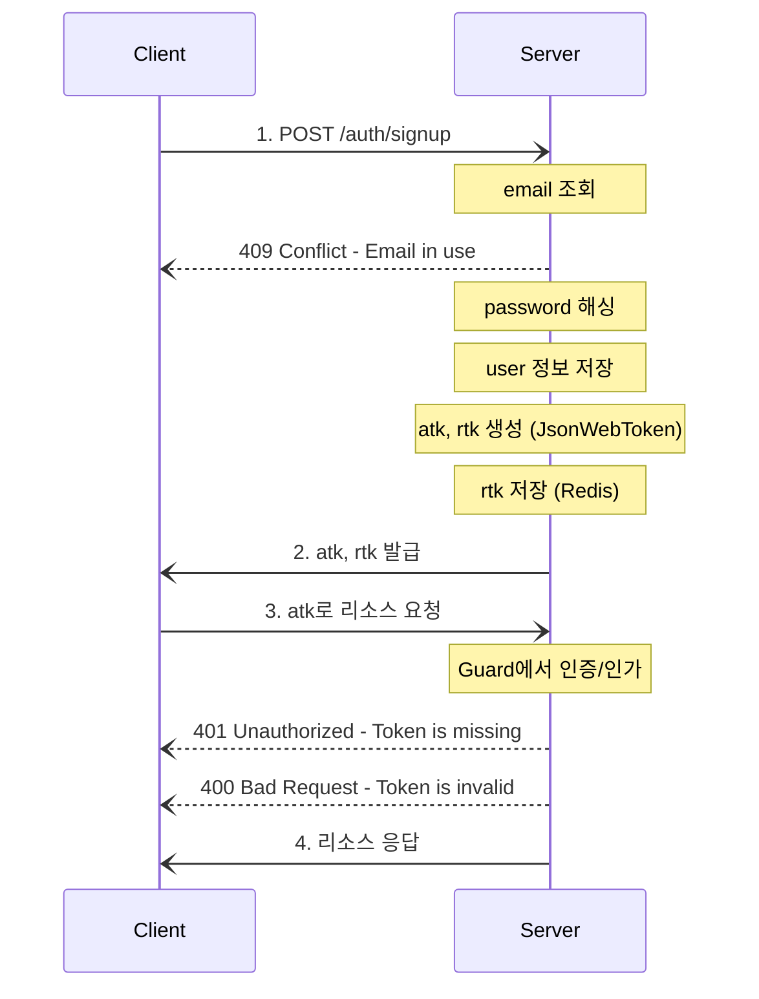
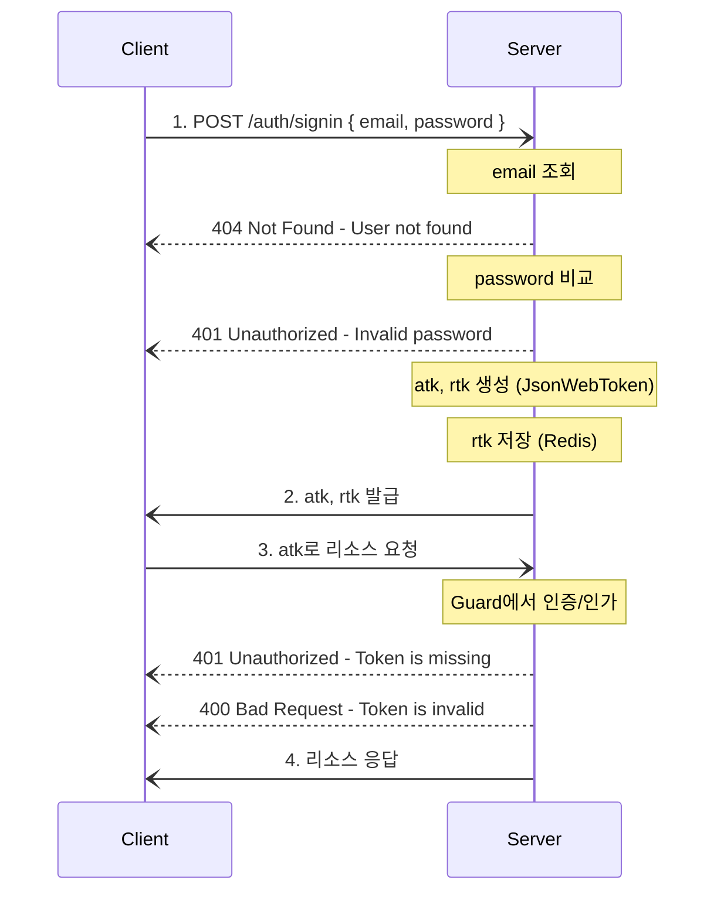
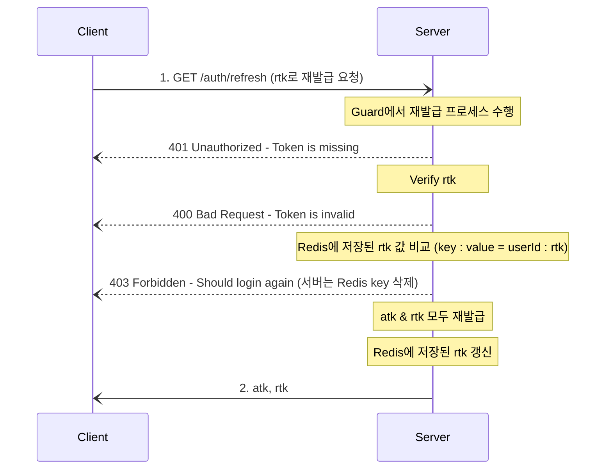
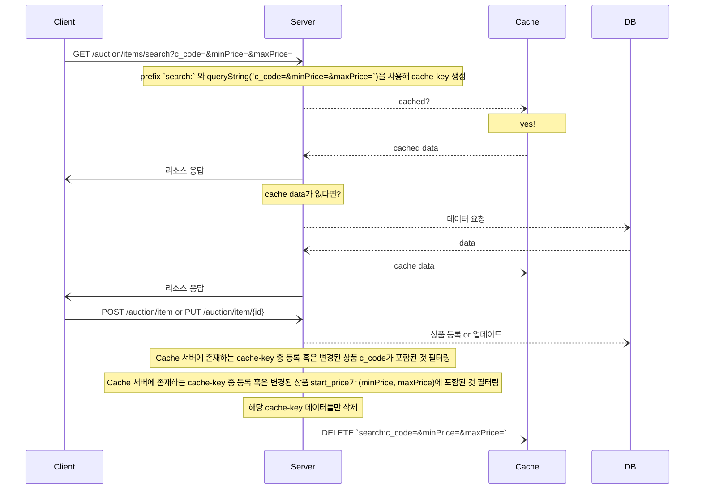
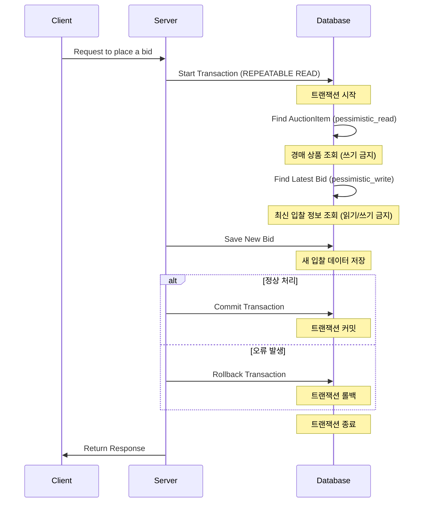
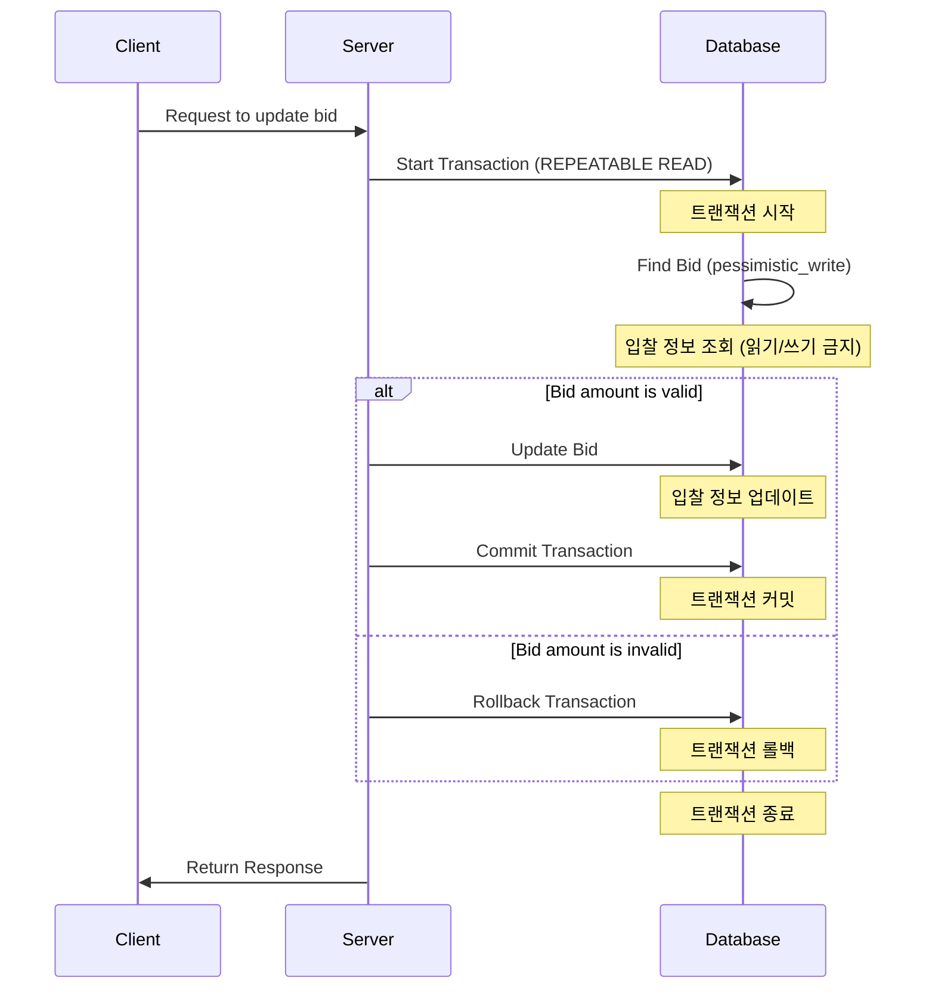

# The Bidders

## Getting started

### Requirements

-   Node.js
-   npm
-   MySQL

### Setup

-   root 디렉토리에 .env 생성
-   환경에 따라 다른 .env 파일 로드
-   production mode
    -   파일명 : `.env.prod`
-   development mode
    -   파일명 : `.env.dev`
-   test mode
    -   파일명 : `.env.test`

### Migration scripts

-   마이그레이션 스크립트 명령어
-   mysql-migrations 디렉토리에서 마이그레이션 파일 관리

```sh
## let TypeORM generate migration file / --env, --name 옵션 필수
## --env=dev , --env=test
$ npm run migration:generate --env= --name=

## create migration file / --name 옵션 필수
$ npm run migration:create --name=

## run migration file / --env 옵션 필수
## --env=dev , --env=test
$ npm run migration:run --env=

## revert migration file / --env 옵션 필수
## --env=dev , --env=test
$ npm run migration:revert --env=
```

### Test

-   `.env.test` 파일 필요

```sh
## unit test
$ npm run test

## e2e test
$ npm run test:e2e
```

### Run

-   `.env.dev` 파일 필요

```sh
## Dev mode
$ npm run start:dev
```

<br>
<br>

## Authentication flow

### Sign up 프로세스



<br>

### Sign in 프로세스



<br>

### Access token 재발급 프로세스

-   **_RTR(Refresh Token Rotation) 도입_**
-   **_JWT로 Refresh Token 생성_**



<br>
<br>

## Cache 무효화 전략



<br>
<br>

## DB 정합성

-   Pessimistic Lock(비관적 락)을 사용하여 경매 입찰 트랜잭션 처리

### Bid Process

1. 트랜잭션 시작
    - 사용자가 경매에 입찰을 할 때, REPEATABLE READ 격리 수준의 트랜잭션 시작
2. 경매 상품 조회
    - 데이터베이스에서 해당 경매 상품의 정보를 조회
    - 입착 가격이 시작 가격 이상인지 확인하기 위함
    - `pessimistic_read` 락을 적용하여 다른 트랜잭션에서 해당 상품에 대한 쓰기 작업 방지
3. 최신 입찰 정보 조회
    - 경매 상품에 대한 최신 입찰 정보 조회
    - 사용자의 입찰 가격이 현재 최고 입찰 가격보다 높은지 확인하기 위함
    - `pessimistic_write` 락을 적용하여 다른 트랜잭션에서 데이터의 읽기 및 쓰기 작업 방지
4. 입찰 데이터 저장
    - 새로운 입찰 데이터 생성 후 데이터베이스에 저장
5. 트랜잭션 커밋 or 롤백
    - 모든 처리가 정상적으로 완료되면 트랜잭션을 커밋하여 데이터베이스에 반영
    - 오류가 발생하는 경우 트랜잭션을 롤백하여 모든 변경사항 취소

<br>



<br>


