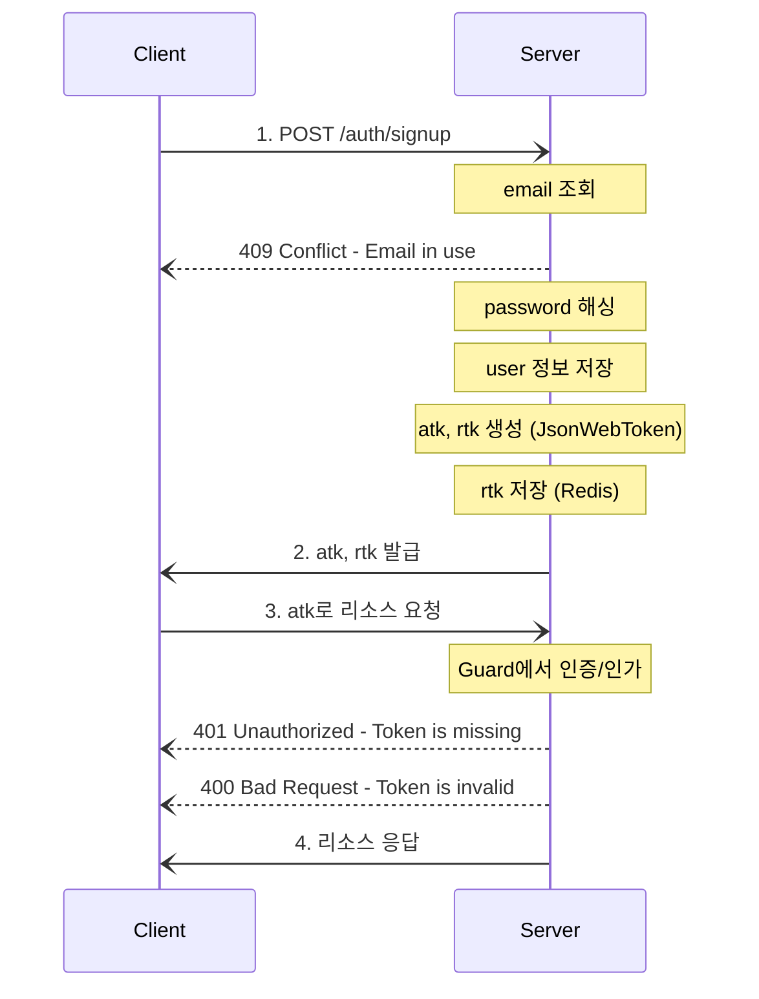
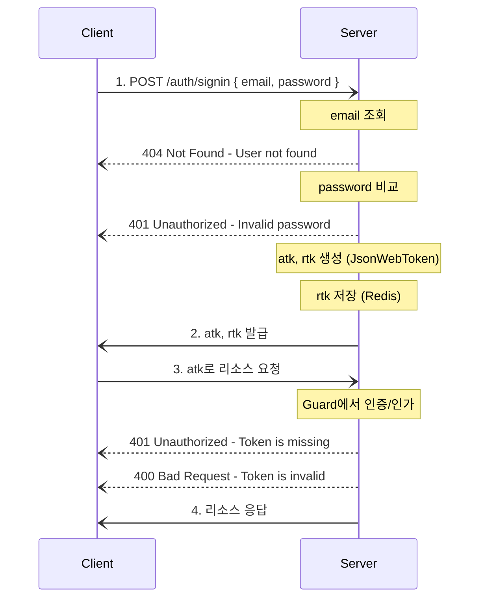
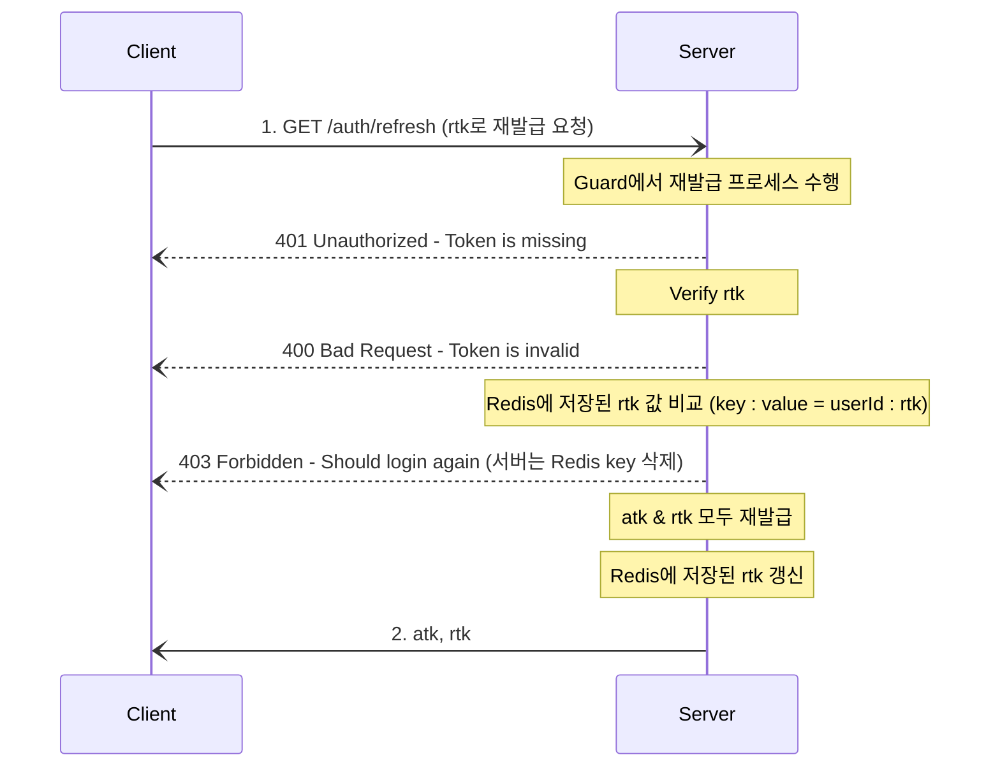
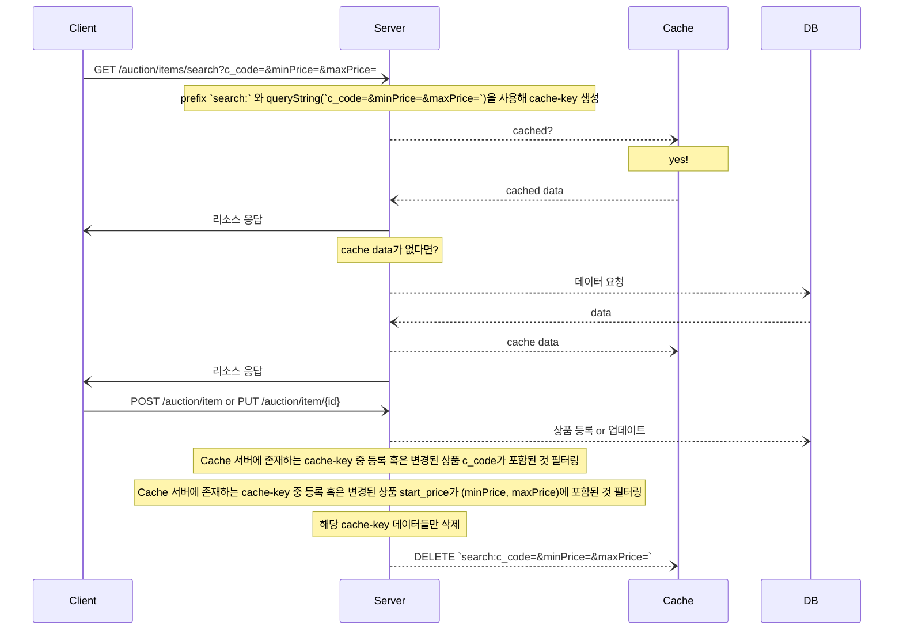

# The Bidders

## Getting started

### Requirements

-   Node.js
-   npm
-   MySQL

### Setup

-   root 디렉토리에 .env 생성

```
NODE_ENV=
PORT=

DB_HOST=
DB_PORT=
DB_USER=
DB_PASSWORD=
DB_NAME=
```

### Migration scripts

-   마이그레이션 스크립트 명령어
-   mysql-migrations 디렉토리에서 마이그레이션 파일 관리

```sh
## let TypeORM generate migration file / --name 옵션 필수
$ npm run migration:generate --name=

## create migration file / --name 옵션 필수
$ npm run migration:create --name=

## run migration file
$ npm run migration:run

## revert migration file
$ npm run migration:revert
```

### Test

```sh
$ npm run test
```

### Run

```sh
## Dev mode
$ npm run start:dev
```

<br>

## Authentication flow

### Sign up 프로세스



<br>

### Sign in 프로세스



<br>

### Access token 재발급 프로세스

-   **_RTR(Refresh Token Rotation) 도입_**
-   **_JWT로 Refresh Token 생성_**



<br>

## Cache 무효화 전략


